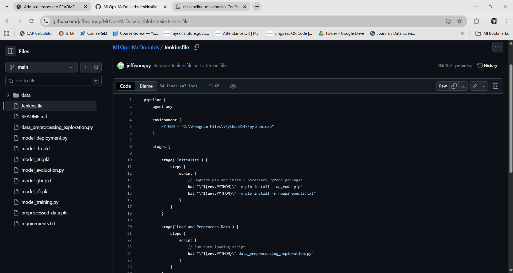
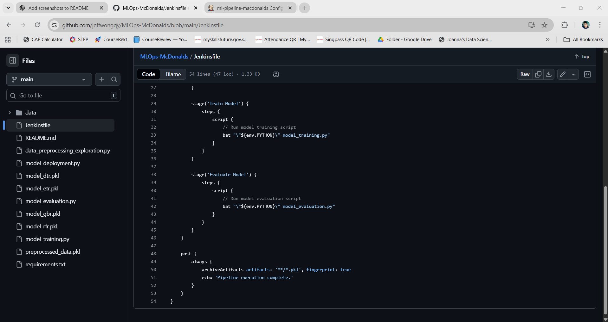
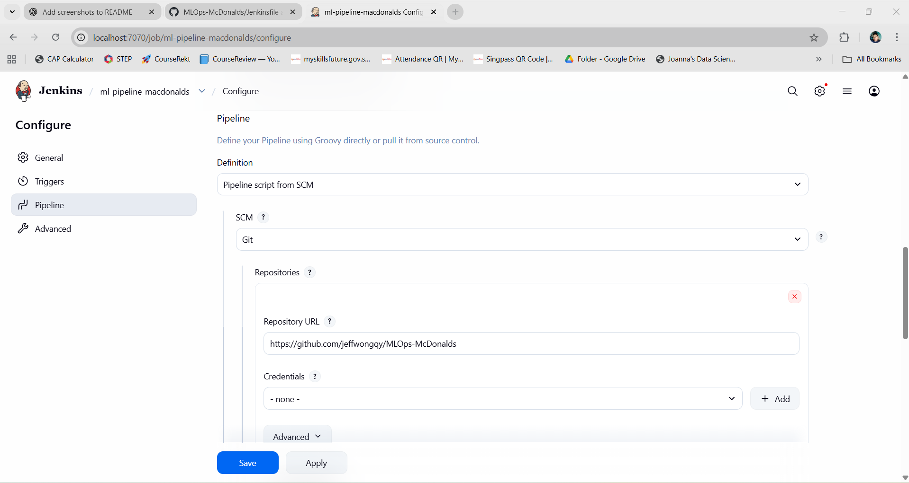
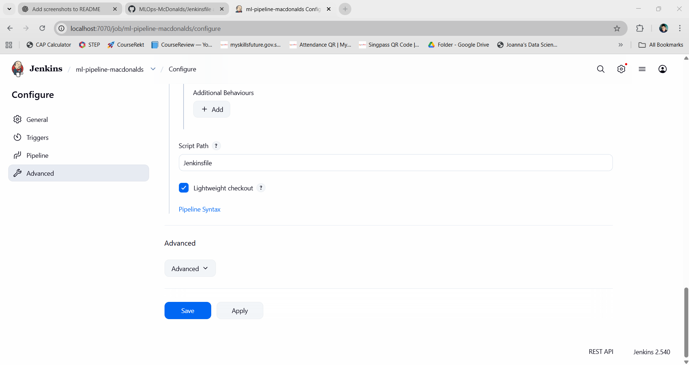
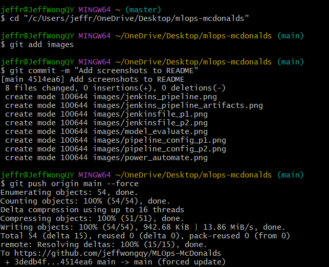

# MLOps for Calories Prediction Based on McDonald's Nutrition Facts

## **Aim:**
This project aims to develop a robust, automated machine learning pipeline for predicting the calorie content of McDonald’s menu items based on their nutritional facts, leveraging real-world data and MLOps practices to ensure reproducibility, scalability, and continuous deployment.

## **Objectives:**
- Collect and preprocess real-world McDonald’s nutrition data.
- Build and evaluate machine learning models to predict calories.
- Implement MLOps workflow using GitHub, Jenkins, and Docker.
- Deploy the model for automated calorie prediction.

## **Collect Real-World McDonald's Nutrition Data:**
Real-world McDonald’s nutrition data was collected from Nutritionix (https://www.nutritionix.com/mcdonalds/menu/premium?desktop) by using Microsoft Power Automate to extract table values and store them in Microsoft Excel for further analysis.

## **Data Preprocessing and EDA:**
The collected McDonald’s nutrition data was preprocessed to ensure quality and consistency. Missing or special values (e.g., <5) were replaced, duplicates were checked, and numeric columns were converted to proper types. Menu items were categorized into meaningful groups, and categorical features were encoded as labels. Irrelevant columns, such as “Food Menu,” were dropped.

Exploratory Data Analysis (EDA) involved visualizing the distributions of numerical features using histograms and boxplots, analyzing categorical distributions with bar plots, and examining relationships between features through a correlation heatmap. 

Feature selection was performed using Lasso regression to identify the most predictive nutritional features, and selected features were scaled using the PowerTransformer for model training. Finally, preprocessed training and test datasets were saved for downstream modeling.

## **Model Training:**
Preprocessed McDonald’s nutrition data was used to train multiple regression models, including Decision Tree, Random Forest, Gradient Boosting, and Extra Trees Regressors. Hyperparameter tuning was performed using GridSearchCV with 5-fold cross-validation, optimizing for mean squared error (MSE) and R². The best-performing models were identified, evaluated, and saved using joblib for downstream prediction tasks.

## **Model Evaluation:**
The trained regression models were evaluated on both training and test datasets using metrics including R², Mean Absolute Error (MAE), Mean Squared Error (MSE), and Root Mean Squared Error (RMSE). This evaluation quantified how well each model predicted calorie values, allowing comparison of model performance and selection of the most accurate model for deployment.

## **Jenkins Configuration & Pipeline:**
The Jenkins pipeline automates the end-to-end workflow of the calorie prediction project. It includes stages for environment setup (installing Python packages), data loading and preprocessing, model training, and model evaluation. After execution, trained models and artifacts (.pkl files) are archived for tracking and future use, ensuring reproducible and automated ML workflows.

## **Git Worflow:**
To manage project code, changes are first staged using git add, then committed locally with `git commit -m "message"`, 

