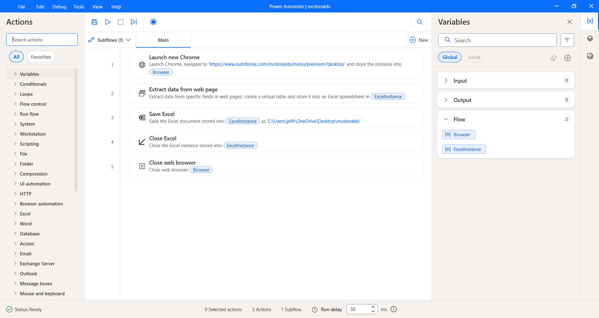

# MLOps for Calories Prediction Based on McDonald's Nutrition Facts

## **Aim:**
This project aims to develop a robust, automated machine learning pipeline for predicting the calorie content of McDonald’s menu items based on their nutritional facts, leveraging real-world data and MLOps practices to ensure reproducibility, scalability, and continuous deployment.

## **Objectives:**
- Collect and preprocess real-world McDonald’s nutrition data.
- Build and evaluate machine learning models to predict calories.
- Implement MLOps workflow using GitHub, Jenkins, and Docker.
- Deploy the model for automated calorie prediction.

## **Collect Real-World McDonald's Nutrition Data:**
Real-world McDonald’s nutrition data was collected from Nutritionix (https://www.nutritionix.com/mcdonalds/menu/premium?desktop) by using Microsoft Power Automate to extract table values and store them in Microsoft Excel for further analysis.

